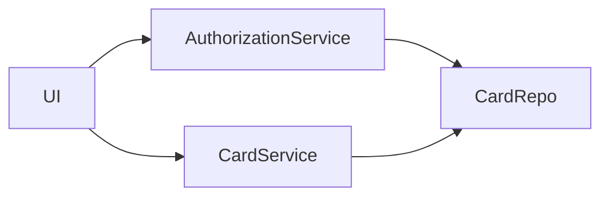
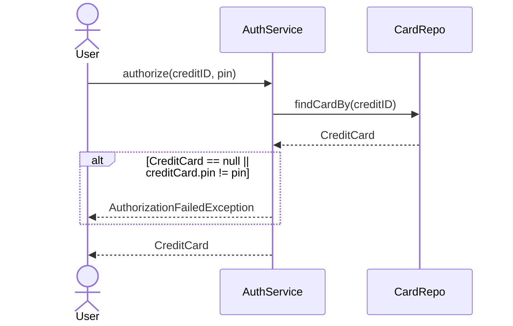
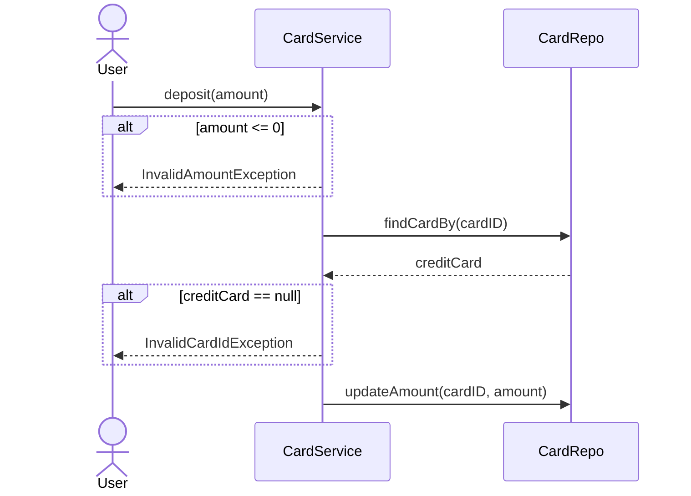
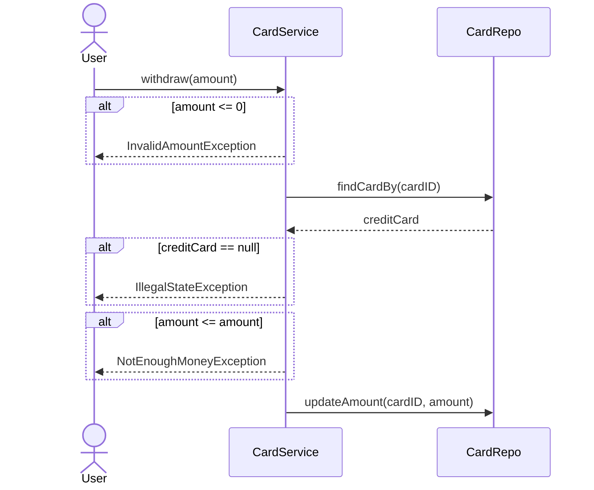
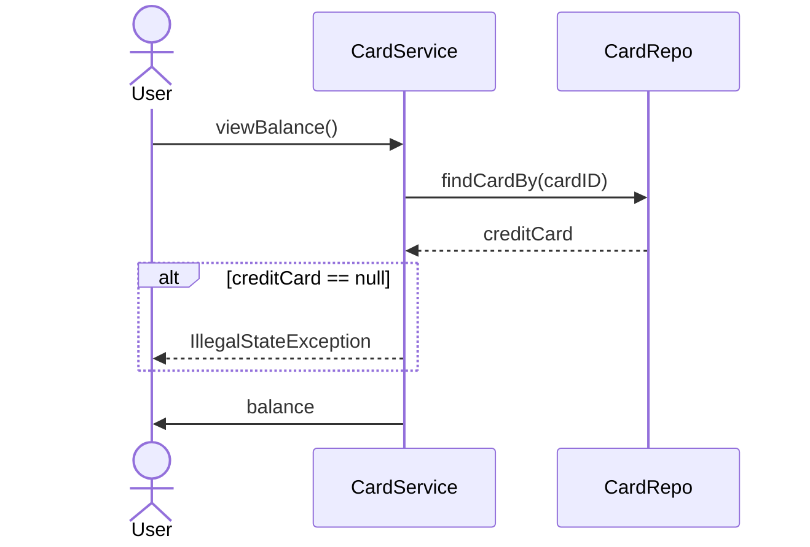
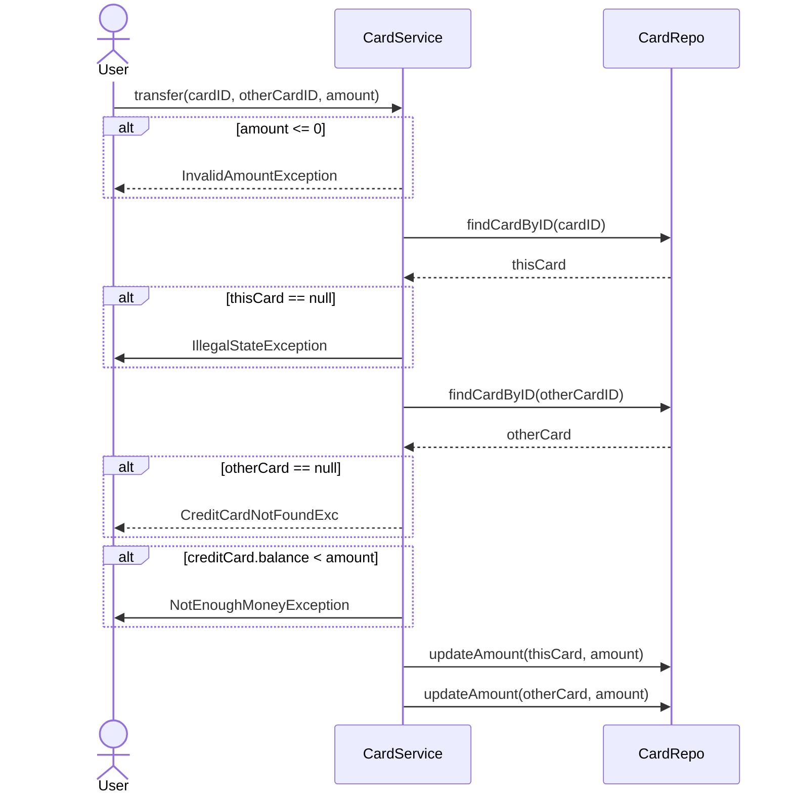

# Technical Documentation

### High Level Architecture

```mermaid
flowchart LR
    UI --> AuthorizationService --> CardRepo
    UI --> CardService --> CardRepo
```

## Authorization:

```mermaid
sequenceDiagram
    actor U as User
    participant S as AuthService
    participant R as CardRepo
    U ->> S: authorize(creditID, pin)
    S ->> R: findCardBy(creditID)
    R -->> S: CreditCard
    alt CreditCard == null || creditCard.pin != pin
        S -->> U: AuthorizationFailedException
    end
    S -->> U: CreditCard
```

## Deposit:

```mermaid
sequenceDiagram
    actor U as User
    participant S as CardService
    participant R as CardRepo
    U ->> S: deposit(amount)
    alt amount <= 0
        S -->> U: InvalidAmountException
    end
    S ->> R: findCardBy(cardID)
    R -->> S: creditCard
    alt creditCard == null
        S -->> U: InvalidCardIdException
    end
    S ->> R: updateAmount(cardID, amount)
%%S -->> U: msg(succeed)
```

## Withdraw:

```mermaid
sequenceDiagram
    actor U as User
    participant S as CardService
    participant R as CardRepo
    U ->> S: withdraw(amount)
    alt amount <= 0
        S -->> U: InvalidAmountException
    end
    S ->> R: findCardBy(cardID)
    R -->> S: creditCard
    alt creditCard == null
        S -->> U: IllegalStateException
    end
    alt amount <= amount
        S -->> U: NotEnoughMoneyException
    end
    S ->> R: updateAmount(cardID, amount)
```

## Balance:

```mermaid
sequenceDiagram
    actor U as User
    participant S as CardService
    participant R as CardRepo
    U ->> S: viewBalance()
    S ->> R: findCardBy(cardID)
    R -->> S: creditCard
    alt creditCard == null
        S -->> U: IllegalStateException
    end
    S ->> U: balance
```

## Transfer

```mermaid
sequenceDiagram
    actor U as User
    participant S as CardService
    participant R as CardRepo
    U ->> S: transfer(cardID, otherCardID, amount)
    alt amount <= 0
        S -->> U: InvalidAmountException
    end
    S ->> R: findCardByID(cardID)
    R -->> S: thisCard
    alt thisCard == null
        S ->> U: IllegalStateException
    end
    S ->> R: findCardByID(otherCardID)
    R -->> S: otherCard

    alt otherCard == null 
       S -->> U: CreditCardNotFoundExc 
    end
    alt creditCard.balance < amount
        S ->> U: NotEnoughMoneyException
    end

%%S ->> R: transfer(cardID, otherCardID, amount)
    S ->> R: updateAmount(thisCard, amount)
    S ->> R: updateAmount(otherCard, amount)
```