# Technical Documentation

### High Lever Architecture
- Client

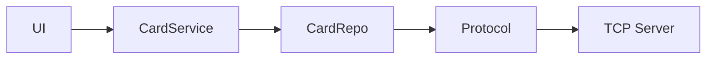

- Server

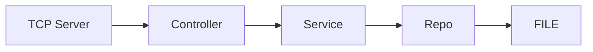


### Application startup:
- Arguments for server:
```
--server ip port dataSourceFilePath
```
- Arguments for client:
```
--client ip port
```
## Packages:

```
- AuthorizeRequest(ID, Pin)
- DepositRequest(ID, Amount)
- WithdrawRequest(ID, Amount)
- TransferRequest(fromID, toID, Amount)
- ViewBalanceRequest(ID)

- AuthorizeResponse()
- DepositResponse()
- WithdrawResponse()
- TransferResponse()
- ViewBalanceResponse(int Amount)
- ErrorResponse(int ExceptionType)
  | AuthorizationFailedExc (91) |
  | InvalidAmountExc (92)       |
  | CreditCardNotFoundExc (93)  |
  | NotEnoughMoneyExc (94)      |
  | IllegalStateExc (95)        |
```


## Authorization:
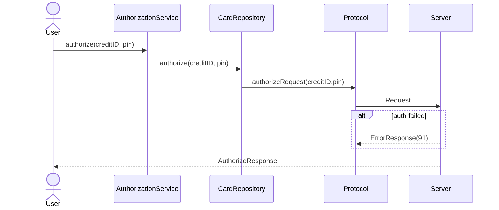
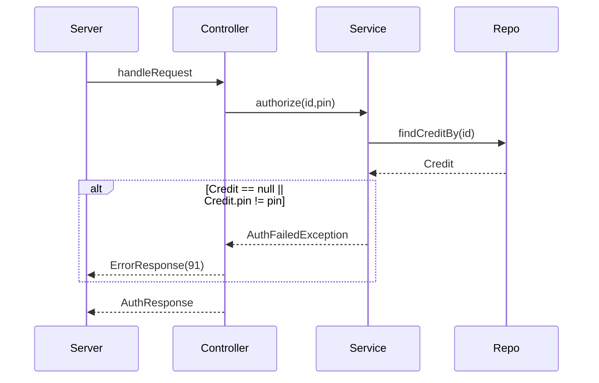

## Deposit:
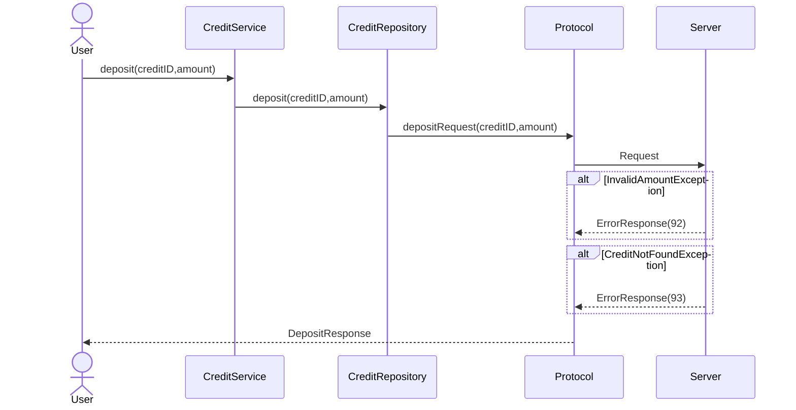
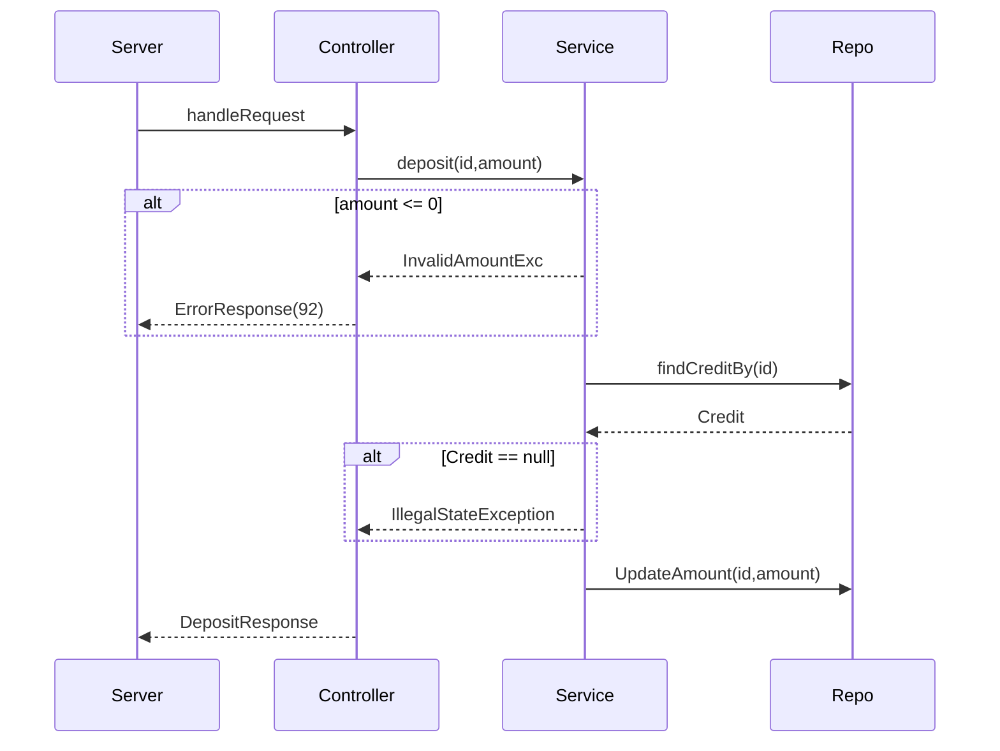

## Withdraw:
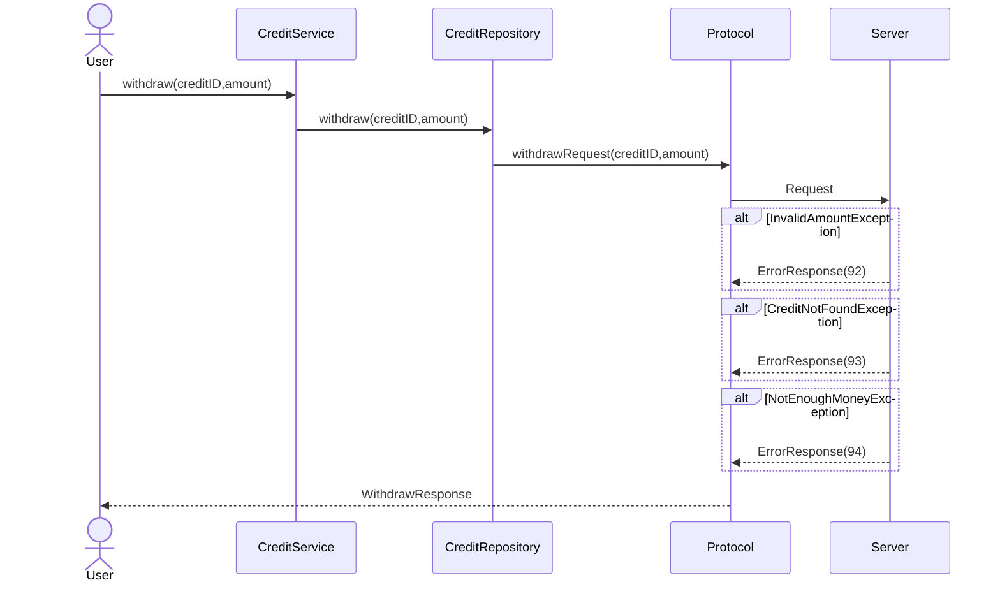

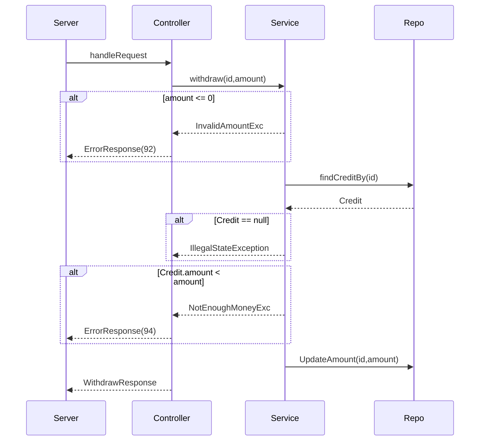

## Transfer:
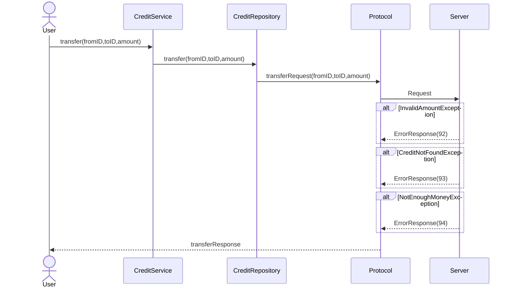
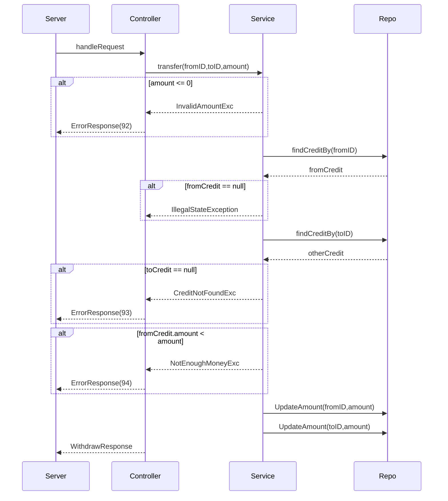

## ViewBalance:
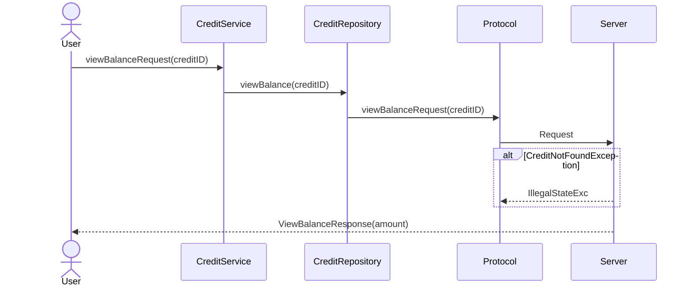
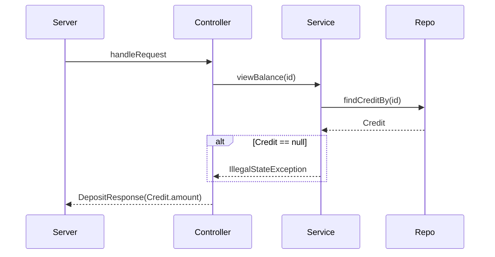
